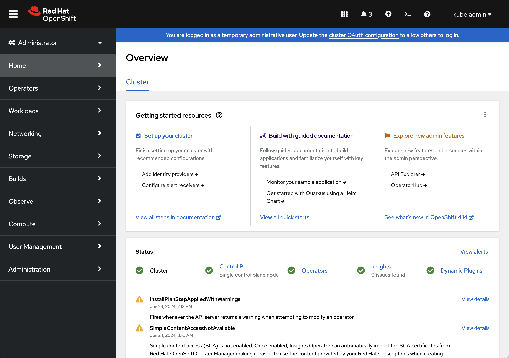
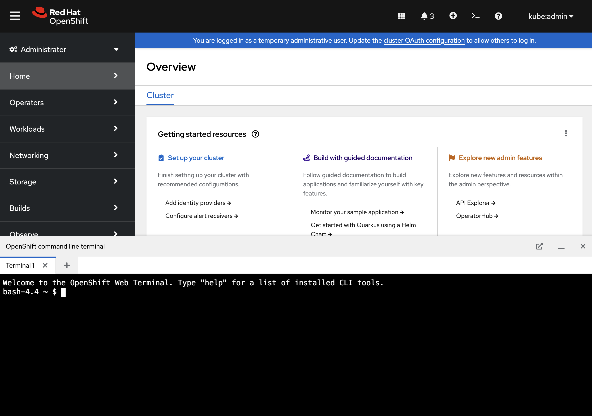

# Tutorial 1 - Environment Access

For the purpose of this tutorial, each participant will make use of an Kubernetes based OpenShift environment to work through the exercises. Access to environments, including the endpoints and credentials  will be provided by the instructors.

## Exploring the Environment

Once details relating to the environment has been provided, the next step is accessing the target OpenShift environment. Two methods can be used to interact with an OpenShift environment:

* OpenShift Web Console
* Command Line Interface (CLI)

The OpenShift CLI tool (`oc`) is a superset of the features provided by the Kubernetes CLI (`kubectl`) and provides capabilities tailored for OpenShift environments. However, none of the material contained within this tutorial make use of the OpenShift specific features.

However, instead of using either of the CLI options, all actions will be performed using the OpenShift Web Console and the included tooling.

### Interacting With the Environment

Navigate to the OpenShift Web Console using the URL associated with your environment. Enter the username and password on the login page using the credentials provided. Once authenticated, you will be presented with the OpenShift Dashboard. Feel free to browse around to become familiar with the options available as they may be helpful when working through the exercises.

The [Web Terminal](https://docs.openshift.com/container-platform/4.15/web_console/web_terminal/odc-using-web-terminal.html) is a capability found embedded within the OpenShift Web Console and includes tools, such as `kubectl`, `helm`, `jq`, to assist when working with the platform. It also simplifies how to work through the exercises as no additional set up or configuration is needed on end user workstations.

The Web Terminal can be accessed from the OpenShift Web Console by clicking on the Terminal icon on the masthead of the console, next to the username. 



Click on the Terminal icon to launch a session which will open a pane at the bottom of the screen



The Web Terminal, by default, starts the session within the home directory of a user named `user` at `/home/user`. To provide a common baseline throughout the exercises, set the `TUTORIAL_ROOT` environment variable to represent the baseline location resources will be created:

```shell
export TUTORIAL_ROOT=/home/user
```

### Ingress

The OpenShift environment includes an [HAProxy](https://www.haproxy.org) based Ingress Controller that can be used to access applications running within the environment. A wildcard DNS entry has been configured to resolve any address underneath a subdomain using the pattern `apps.$BASE_DOMAIN`. A CustomResourceDefinition named `DNS` contains DNS related information related to the environment.

Set the `APP_DOMAIN` environment to contain the subdomain for which all eternally facing applications can be accessed:

```shell
export APP_DOMAIN=apps.$(kubectl get dns cluster -o jsonpath='{ .spec.baseDomain }')
```

Confirm the variable has been populated:

```shell
echo $APP_DOMAIN
```

A value similar to `apps.cluster-xxxxx.xxxxx.sandboxxxxx.opentlc.com` indicates the `APP_DOMAIN` variable has been set properly

With an understanding of the infrastructure that will be used for the tutorial along with setting up the initial configurations to work within this environment, we can get started. Proceed to the next tutorial where the we meet Bob and Kaya and learn more about Bob's application, its architecture, and how it can be deployed within the Kubernetes environment.

[Previous Tutorial - Overview](tutorial0.md)

[Next Tutorial - Application Deployment](tutorial2.md)

[Home](../README.md)
