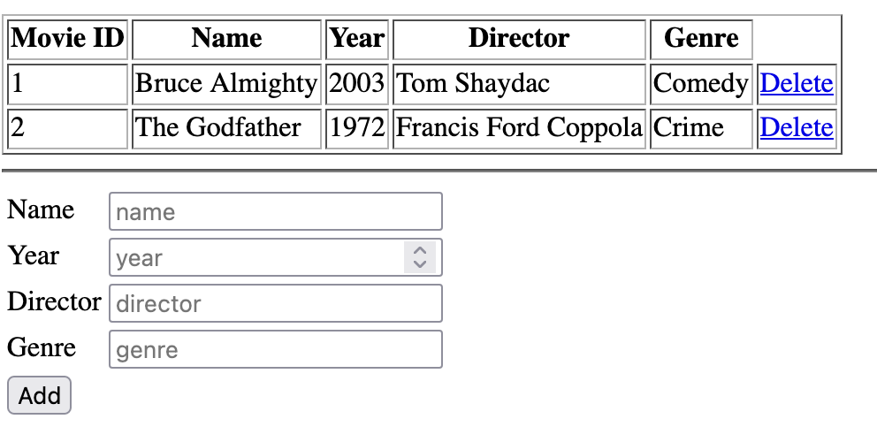

# Tutorial 2 - Deploying the Application

Kaya has thoughts about how to harden Bob's application, but she first would like to see the application firsthand within one of her Kubernetes clusters (the same cluster you just accessed in the prior tutorial). During this tutorial, obtain the resources associated with Bob's application and deploy the application within the Kubernetes environment. 

## Obtain the Project Resources

Bob's application and the remainder of the resources associated with the tutorial are located in the accompanying git repository. Ensure that you are in the directory represented by the `TUTORIAL_ROOT` environment and clone the repository to this location:

```shell
cd $TUTORIAL_ROOT
git clone https://github.com/sabre1041/cloudnativesecuritycon-workload-identity-tutorial
```

Now, change into the project repository directory:

```shell
cd $TUTORIAL_ROOT/cloudnativesecuritycon-workload-identity-tutorial
```

## Deploy the Application

With the git repository cloned within the Web Terminal environment, the resources associated with Bob's application is contained within the `resources/baseline` directory and consists of the following:

* Namespace (`namespace.yaml`)
* MySQL Database (`db.yaml`)
  * Deployment
  * Service
  * ConfigMap
* Python Application (`py.yaml`)
  * Deployment
  * Service
  * ConfigMap
  * Ingress

### Create a Namespace

First, create a `Namespace` called `workload-identity-tutorial` to contain all of the resources assocaited with the tutorial exercises. A manifest file is located in the [namespace.yaml](../resources/baseline/namespace.yaml) file.

Apply the manifest file to create the Namespace

```shell
kubectl apply -f $TUTORIAL_ROOT/cloudnativesecuritycon-workload-identity-tutorial/resources/baseline/namespace.yaml
```

### Deploy the MySQL Database

Records associated with the application are stored within a MySQL relational database and located in the [db.yaml](../resources/baseline/db.yaml) file. By inspecting the file, you will also notice a `ConfigMap` called `mysql-initdb-config` which initializes and populates the database with sample records.

Deploy the database related resources using the following command:

```shell
kubectl apply -f $TUTORIAL_ROOT/cloudnativesecuritycon-workload-identity-tutorial/resources/baseline/db.yaml
```

Confirm the database is running by listing the pods in the `workload-identity-tutorial` namespace.

```shell
kubectl get pods -n workload-identity-tutorial -l=app=db
```

There should be 1 database pod with a status of _Running_ as shown below:

```
NAME                  READY   STATUS    RESTARTS   AGE
db-6b7d6788cc-f4l8c   1/1     Running   0          29s
```

### Deploy the Python Application

The next step is to deploy the resources associated with the Python application located in the `py.yaml` file. To inject the location of the ingress subdomain that is stored in the `APP_DOMAIN` into the `Ingress` resource, the `envsubst` utility will be used. Ensure this variable is still defined and execute the following command to deploy the Python application to the `workload-identity-tutorial` namespace:

```shell
envsubst < $TUTORIAL_ROOT/cloudnativesecuritycon-workload-identity-tutorial/resources/baseline/py.yaml | kubectl apply -f - 
```

Confirm that the Python application named `py` deployed successfully to the `workload-identity-tutorial` namespace:

```shell
kubectl get pods -n workload-identity-tutorial -l=app=py
```

There should be 1 python pod with a status of _Running_ as shown below:

```
NAME                  READY   STATUS    RESTARTS   AGE
py-7dbcf96766-9f97q   1/1     Running   0          35s
```

With the database and python application both deployed to the cluster, obtain the URL for the `Ingress` resource to verify the application can be accessed from outside the cluster

```shell
echo https://$(kubectl -n workload-identity-tutorial get ingress py -o jsonpath='{ .spec.rules[*].host }')
```

Open a web browser and navigate to the URL provided as an output from the previous command. A result similar to the following containing a table populated with movie titles indicates the deployment was successful.



Kaya is happy to see that she was able to successfully deploy Bob's application to the Kubernetes cluster. In the next tutorial exercise, Kaya will work with Bob to identify the security challenges currently present within the application and an approach to harden the posture of the application as it relates to security moving forward.

[Previous Tutorial - Environment Access](tutorial1.md)

[Next Tutorial - Identifying Security Challenges](tutorial3.md)

[Home](../README.md)
